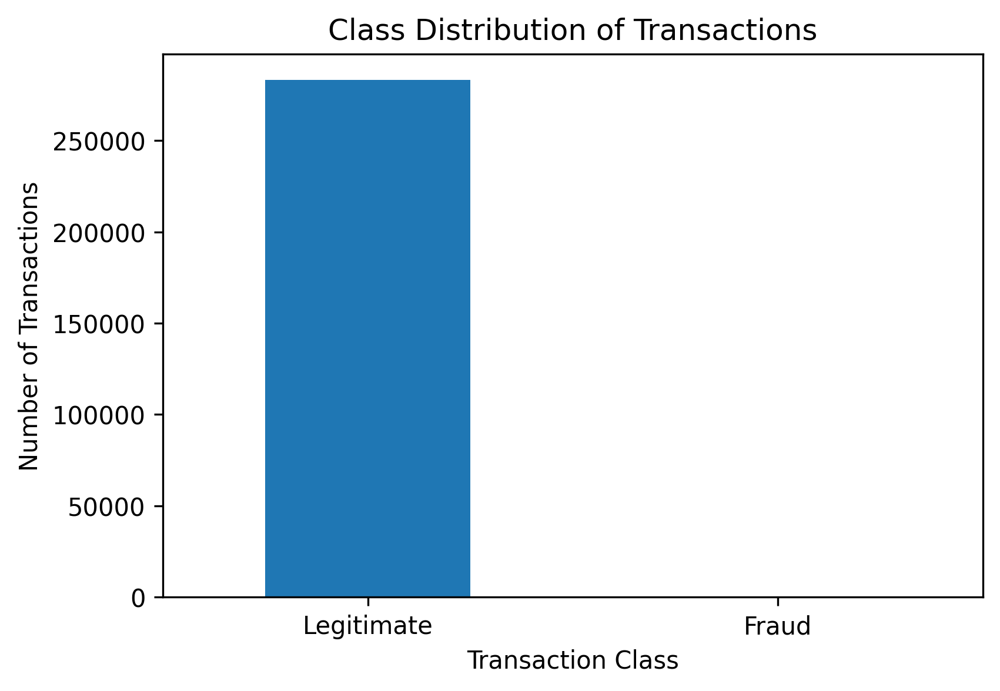
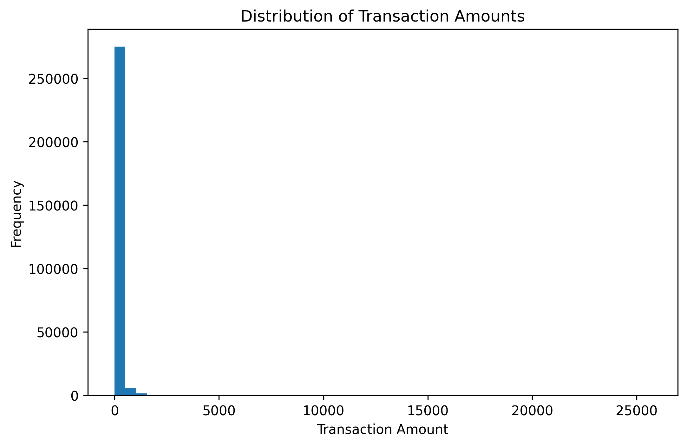
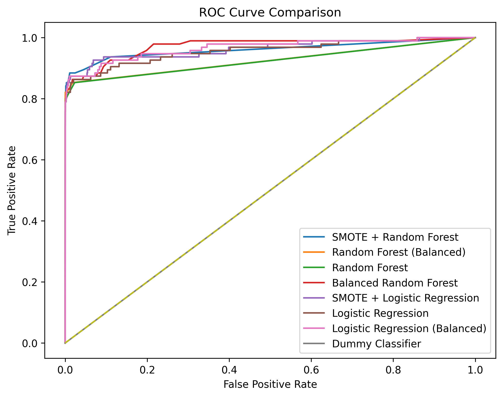
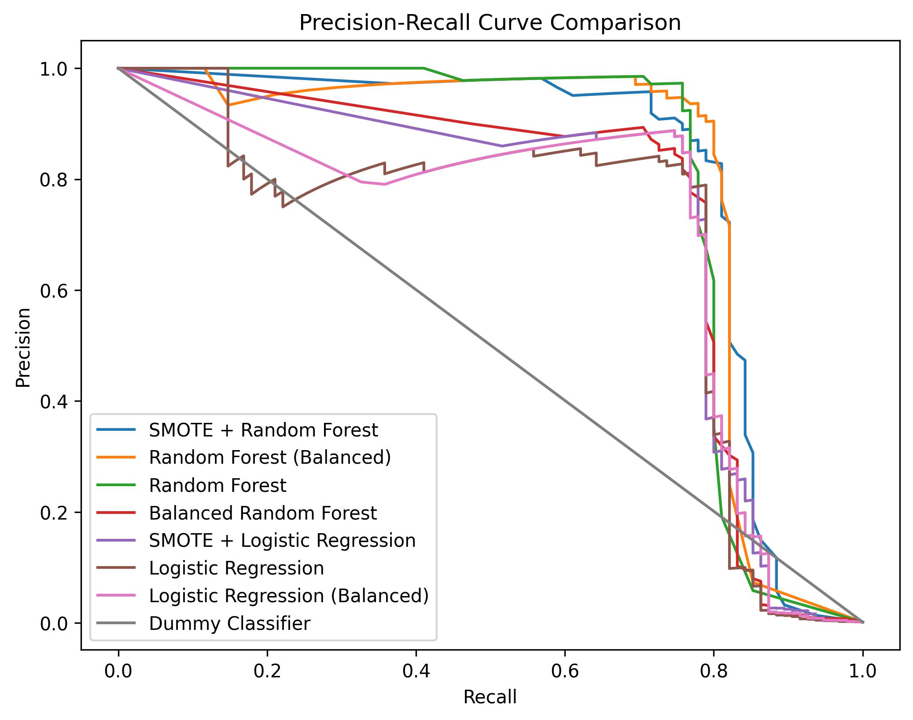
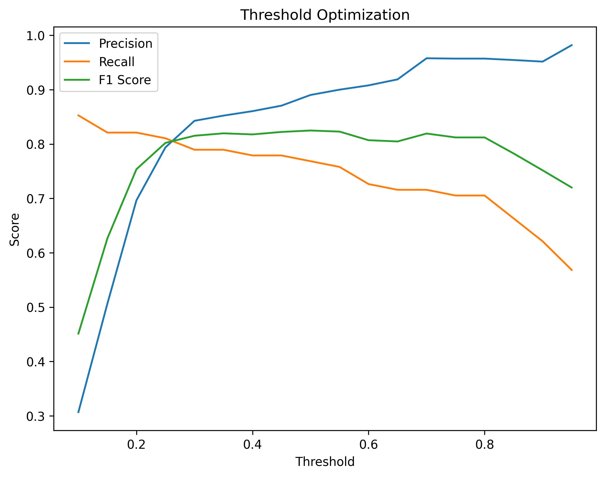
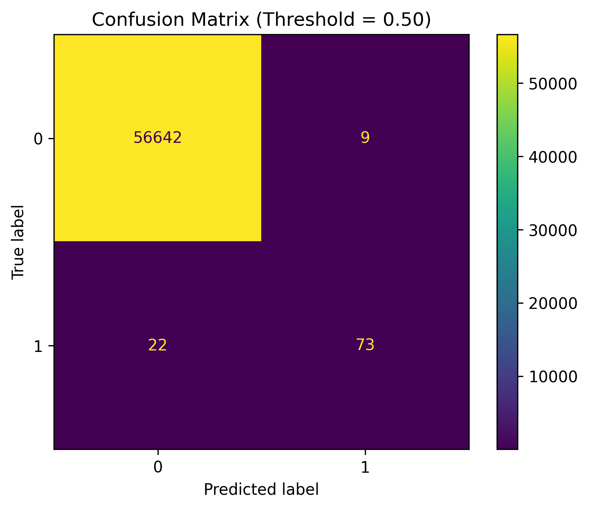

# Credit Card Fraud Detection with Imbalanced Learning and Threshold Optimization

A machine learning project focused on detecting fraudulent credit card transactions in a **highly imbalanced dataset**. The analysis compares baseline and imbalance-aware models, evaluates them using appropriate fraud detection metrics, and applies **threshold optimization** to improve real-world decision-making.

---

## Project Overview

Fraud detection is a classic **rare-event classification problem**. In the dataset used in this project, fraudulent transactions represent only a tiny fraction of all observations. This extreme imbalance makes traditional evaluation metrics such as accuracy potentially misleading.

This project investigates:

- how severe the class imbalance is
- which modeling strategies perform best on fraud detection
- how threshold tuning influences precision–recall trade-offs

To address these questions, the project compares baseline models with **imbalance-aware techniques**, including:

- class weighting
- SMOTE oversampling
- balanced ensemble learning

The final model is evaluated through **precision–recall analysis and threshold optimization**.

---

## Repository Structure

credit-card-fraud-detection-imbalanced-learning/
│
├── notebooks/
│ └── fraud_detection_imbalanced_learning.ipynb
│
├── figures/
│ ├── class_distribution.png
│ ├── transaction_amount_distribution.png
│ ├── transaction_amount_distribution_by_class.png
│ ├── transaction_time_distribution.png
│ ├── confusion_matrix_smote_random_forest.png
│ ├── confusion_matrix_random_forest.png
│ ├── roc_curve_comparison.png
│ ├── precision_recall_curve_comparison.png
│ ├── threshold_optimization.png
│ └── confusion_matrix_optimized_threshold.png
│
├── data/
│ └── (dataset not included)
│
├── README.md
├── requirements.txt
└── .gitignore

---

## Dataset

This project uses the **Credit Card Fraud Detection dataset**.

Because the dataset file (~150 MB) exceeds GitHub's file size limits, it is **not included in this repository**.

You can download it from Kaggle:

https://www.kaggle.com/datasets/mlg-ulb/creditcardfraud

After downloading the dataset, place it in:

data/creditcard.csv

The notebook will run without modification once the dataset is placed in that location.

---

## Dataset Characteristics

After duplicate removal, the dataset contains:

- **283,726 transactions**
- **473 fraudulent transactions**
- **283,253 legitimate transactions**

Fraud therefore represents only **0.1667% of all transactions**, making this a **highly imbalanced classification problem**.

---

## Problem Motivation

In highly imbalanced datasets, a model can achieve extremely high accuracy simply by predicting nearly every transaction as legitimate.

In this dataset, a naive classifier can reach **99.83% accuracy while detecting zero fraud cases**.

For this reason, this project focuses on more meaningful evaluation metrics:

- **Precision**
- **Recall**
- **F1-score**
- **ROC-AUC**
- **PR-AUC**

Among these, **PR-AUC is particularly important**, since it focuses directly on performance for the minority (fraud) class.

---

## Methodology

The project follows a structured machine learning workflow:

### 1. Data Inspection
- dataset loading
- structural inspection
- missing value analysis
- duplicate detection and removal

### 2. Exploratory Data Analysis
- class imbalance visualization
- transaction amount distribution
- fraud vs legitimate transaction comparison
- transaction time distribution

### 3. Data Preparation
- feature/target separation
- stratified train-test split
- preservation of fraud ratio across training and test sets

### 4. Baseline Models
- Dummy Classifier
- Logistic Regression
- Random Forest

### 5. Imbalance-Aware Models
- Logistic Regression with class weighting
- Random Forest with class weighting
- SMOTE + Logistic Regression
- SMOTE + Random Forest
- Balanced Random Forest

### 6. Model Comparison
Models are evaluated using:

- Accuracy
- Precision
- Recall
- F1-score
- ROC-AUC
- PR-AUC

### 7. Threshold Optimization
The best model is further analyzed by evaluating multiple probability thresholds to find the optimal balance between **fraud detection and false positives**.

---

## Model Performance Summary

| Model | Accuracy | Precision | Recall | F1 Score | ROC-AUC | PR-AUC |
|------|----------:|----------:|-------:|---------:|--------:|-------:|
| SMOTE + Random Forest | 0.9995 | 0.8902 | 0.7684 | 0.8249 | 0.9609 | 0.8041 |
| Random Forest (Balanced) | 0.9995 | 0.9710 | 0.7053 | 0.8171 | 0.9246 | 0.7960 |
| Random Forest | 0.9995 | 0.9718 | 0.7263 | 0.8313 | 0.9239 | 0.7876 |
| Balanced Random Forest | 0.9876 | 0.1030 | 0.8316 | 0.1833 | 0.9716 | 0.7196 |
| SMOTE + Logistic Regression | 0.9912 | 0.1424 | 0.8526 | 0.2440 | 0.9629 | 0.7027 |
| Logistic Regression | 0.9991 | 0.8462 | 0.5789 | 0.6875 | 0.9560 | 0.6920 |
| Logistic Regression (Balanced) | 0.9753 | 0.0564 | 0.8737 | 0.1059 | 0.9657 | 0.6719 |
| Dummy Classifier | 0.9983 | 0.0000 | 0.0000 | 0.0000 | 0.5000 | 0.0017 |

---

## Best Model

The top-performing model according to **PR-AUC** is:

### **SMOTE + Random Forest**

Performance metrics:

- **Precision:** 89.0%
- **Recall:** 76.8%
- **F1-score:** 0.8249
- **PR-AUC:** 0.8041

This model detects a large proportion of fraudulent transactions while keeping false positives low.

---

## Threshold Optimization

Threshold analysis was performed to study how classification cutoffs affect precision and recall.

The best **F1-score** was achieved at a threshold of:

**0.50**

At this threshold:

- **73 fraud cases correctly detected**
- **22 fraud cases missed**
- **9 legitimate transactions falsely flagged**

This demonstrates a strong operational trade-off between fraud detection and false alarm rates.

---

## Visualizations

### Class Imbalance

### Model Evaluation

### Threshold Optimization

---

## How to Run the Project

### Clone the repository

git clone https://github.com/Matvii-Studnytskiy-157/credit-card-fraud-detection-imbalanced-learning.git

cd credit-card-fraud-detection-imbalanced-learning

### Install dependencies

pip install -r requirements.txt

### Open the notebook

notebooks/fraud_detection_imbalanced_learning.ipynb

### Add the dataset

Download the dataset and place it here:

data/creditcard.csv

---

## Requirements

Main dependencies:

- pandas
- numpy
- matplotlib
- scikit-learn
- imbalanced-learn

Install them with:

pip install -r requirements.txt

---

## Future Improvements

Potential extensions of this project include:

- hyperparameter tuning
- cost-sensitive learning
- model explainability with SHAP
- anomaly detection approaches
- time-aware validation strategies
- deployment-ready fraud monitoring pipelines

---

## Author

**Matvii Studnytskiy**

Machine Learning Portfolio Project
